# Visual Studio Code integration

The `B2BUtils` package provide some helper programs that help BP/XSLT development with Visual Studio Code.

## Tasks

Add `tasks.json` to `[ProjectDir]/.vscode` and modify/add build and test tasks. Add

```json
[
  {
    "key": "shift+F2",
    "command": "workbench.action.tasks.runTask",
    "args": "Deploy WFD/XSLT"
  },
  {
    "key": "ctrl+shift+t",
    "command": "workbench.action.tasks.test",
    "when": "editorLangId == xml || editorLangId == xslt"
  }
]
```
to your `keybindings.json`. Press F1 and open keyboar shortcuts (JSON) to open file:

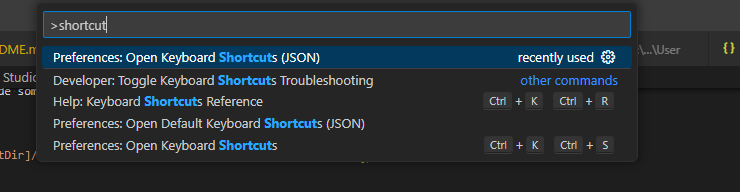

Deploy WFD or XSLT with SHIFT+F2:

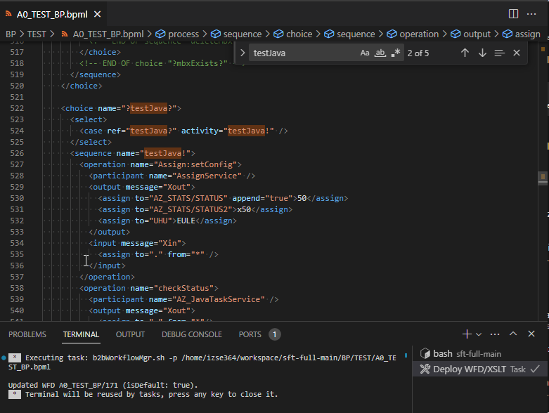

Deploys new version of WFD or XSLT if local file differs from server version. A timestamp is added as comment to the BPML to make B2Bi creating new version if only CDATA fields (SQL, JavaTask) was changed.

CTRL-SHIFT-B (build tasks) provides:

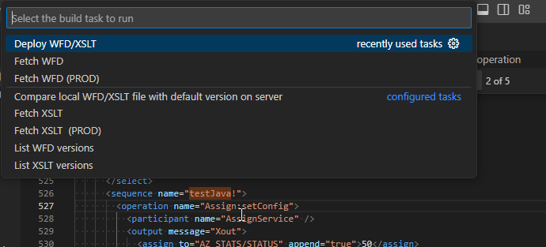

CTRL-SHIFT-T (test tasks) provides:

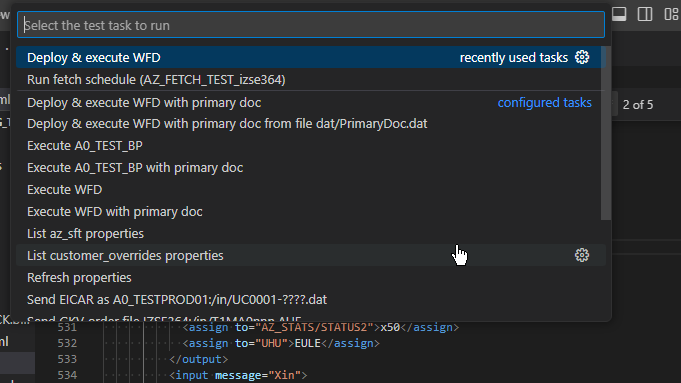

## Examples

### Deploy & excute WFD

"Deploy & execute WFD" deploys WFD in editor on server and executes it and retrieves process trace with `b2bWorkflowMgr.sh -p /path/to/WFD_NAME.bpml -E WFD_NAME -X --pd=!,-1 `:

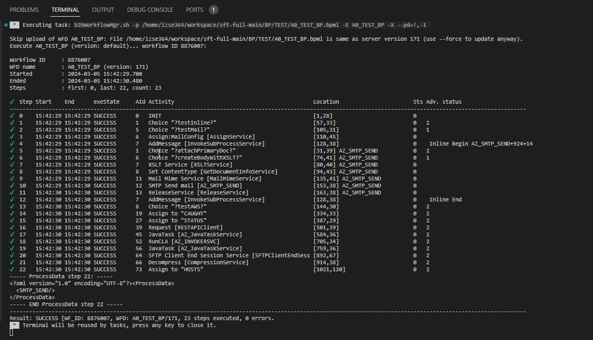

Other variants send primary document (generated with dummy text or from local file).

### List properties

"List a0test properties" lists all (DB) properties with prefix `a0test` (Specify your properties prefix in `tasks.json`):

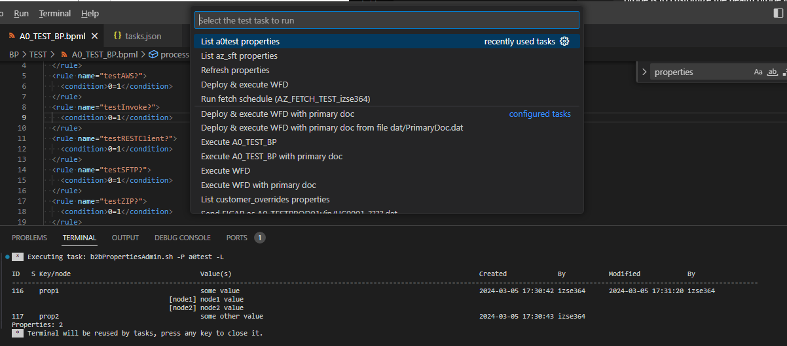

### Refresh properties

"Refresh properties" will refresh all custom properties on all nodes:

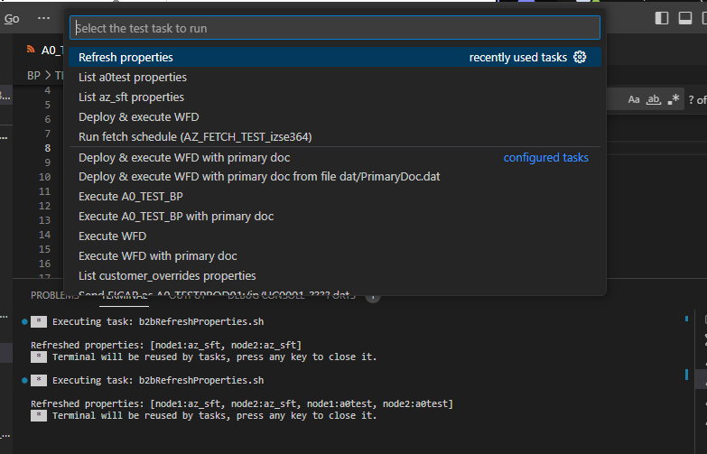

### Send file with SFTP client

The simple SFTP client tool `sftpclient.sh`/`sftpclient.cmd` can be used to send files with SFTP with builtin key and generated dummy data and file names:

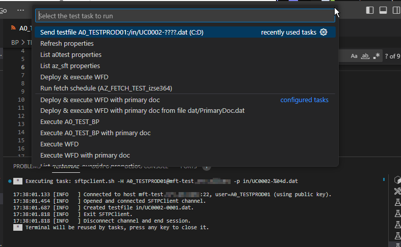

## BPML code snippets for Visual Studio Code

The `bpml.code-snippets` provides autocompletion for many commonly used service/adapter calls on Sterling B2B Integrator.

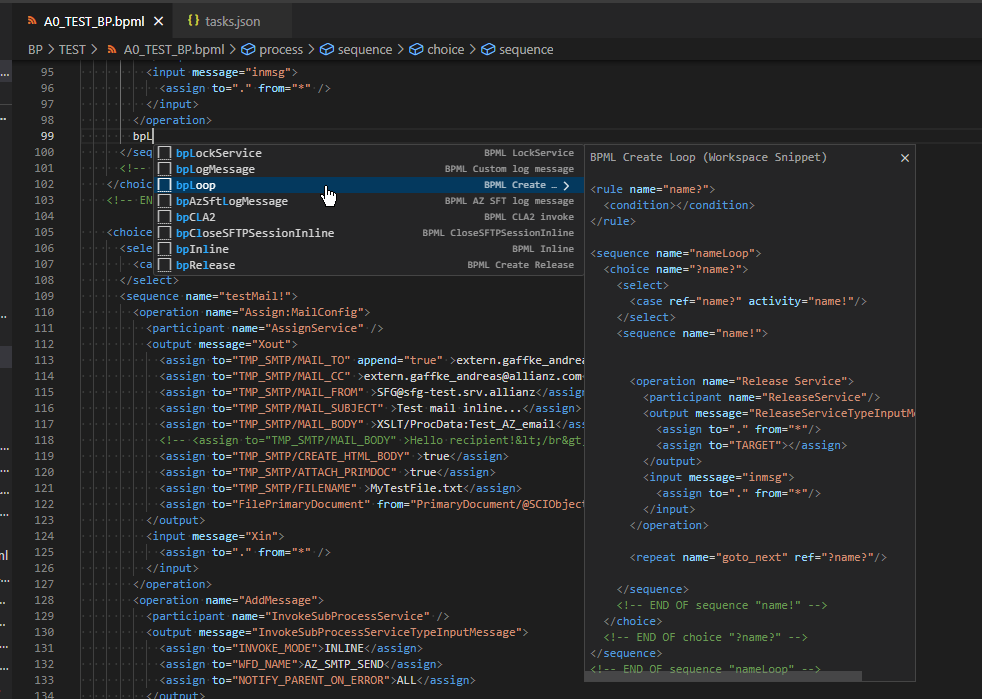

Put this file into `[ProjectDir]/.vscode` folder of your project and quickly create common operations by typping `bp` and choosing the service/adapter call you want to add to your code.

## Notes

* Install the following extensions to help with XML/BPML files:
  * XML extension by RedHat to add language support for XML
  * XML Tools extension by Josh Johnson (add support for XPath)
  * Auto Close Tag extension by Jun Han
  * Auto Close Tag extension, also by Jun Han
* Make sure to assign the `.bpml` file extension to the XML file format in VSCode (search for "files associatons" in settings and add `*.bpml` &rarr; `XML` mapping)

When working with XML files (like ProcessData), it is helpful to have the XPath tools (get/evaluate XPath) in the context menu. To add these menu items, look for the `pacakge.json` file for the `XML Tools` extension (e.g. in `[VSCodeDirectory]/data/extensions/dotjoshjohnson.xml-2.5.1/package.json`) and add the commands `xmlTools.getCurrentXPath` and `xmlTools.evaluateXPath` like:

```json
...
"editor/context": [
    {
      "command": "xmlTools.getCurrentXPath",
      "group": "1_modification@100",
      "when": "editorLangId == xml"
     },
     {
      "command": "xmlTools.evaluateXPath",
      "group": "1_modification@100",
      "when": "editorLangId == xml"
     },
     {
     "command": "xmlTools.minifyXml",
     "group": "1_modification@100",
     "when": "editorLangId == 'xml'"
    }
   ]
...
```
### Get XPath from XML document

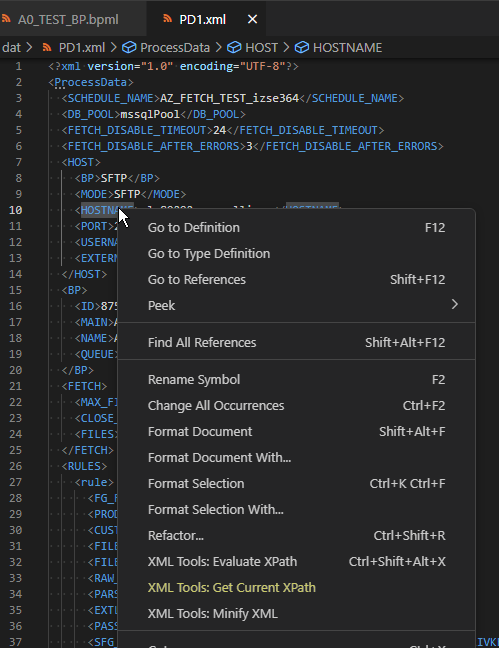

### Evaluate XPath on XML document

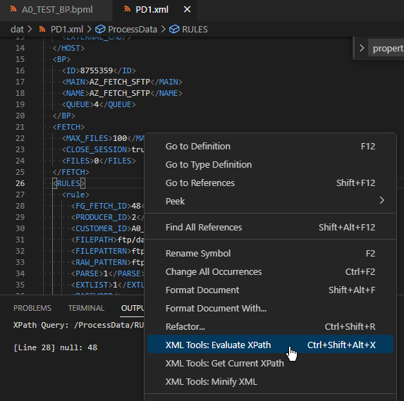

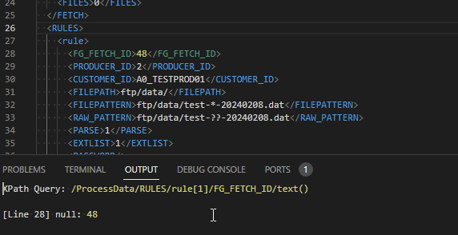

## B2B Integrator services and adpaters

Some snippets address local adapter/service configurations with prefix `DD_` like

* `DD_JavaTaskService` (empty JavaTask service)
* `DD_JDBC_ADAPTER_01` (Lighweight JDBC Adapter)
* `DD_CLA_LOCAL` (local Commandline Adapter 2 instance)
